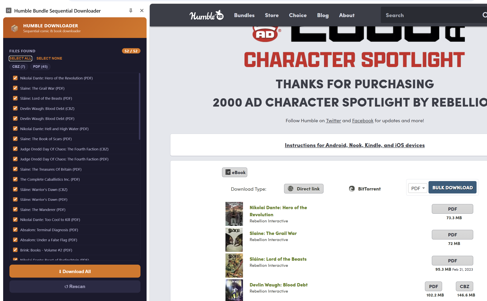
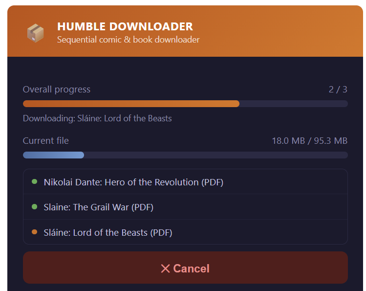

# Humble Bundle Sequential Downloader

A Chrome extension that downloads comics and books from your Humble Bundle library one at a time, waiting for each to finish before starting the next.

## Installation

0. Download the release and unzip it into a folder called `humble-bundle-downloader` somewhere safe
1. Open Chrome and go to `chrome://extensions`
2. Enable **Developer mode** (toggle in the top-right corner)
3. Click **Load unpacked**
4. Select the `humble-bundle-downloader` folder you created earlier

## Usage

0. I'd highly recommend in Chrome going into Settings, Downloads and turning off "Ask where to save each file before downloading" or you're going to get bored clicking
1. Open your Humble Bundle library/download page  
   (e.g. `https://www.humblebundle.com/downloads?key=YOURKEY`)
2. Click the extension icon in the Chrome toolbar — this opens the side panel, which stays docked to the browser window as you navigate
3. Click **Scan for Links** — it will find all comic and book download links on the page
4. Review the list, check or uncheck any titles you don't want, then click **Download Selected**
5. Each file downloads fully before the next one begins

## Notes

- Downloads go to your browser's downloads folder
- If a file already exists, Chrome will append a number to avoid overwriting
- Works with whatever formats Humble Bundle offers for a given title (PDF, EPUB, MOBI, CBZ, CBR, etc.) — the extension keeps each file's original format
- You can cancel mid-queue at any time
- The extension only activates on `humblebundle.com` pages
- The side panel persists across tab switches and page navigation within the window; it automatically updates based on whether or not you're on a Humble Bundle page

## Screenshots

### Pick which files to download

### Progress display

